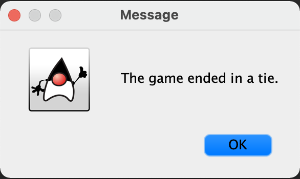

# tic-tac-toe README

Tic-tac-toe application using Java GUI that allows two-player functionality.

When a player wins, a pop-up message will alert who has won.

Pop-up message will occur when it is a tie.

